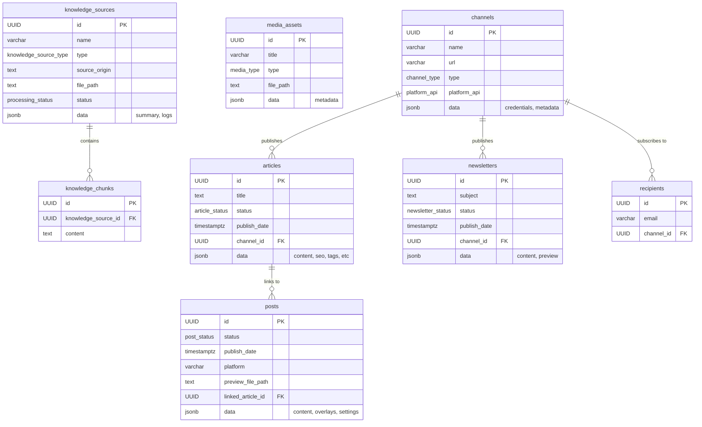

# Content AI Manager - Database Schema

This document outlines the database schema for the Content AI Manager application. The schema uses a relational database (PostgreSQL) with extensive use of `JSONB` to allow for unstructured data flexibility across different platforms (e.g., social media metadata), and specific handling for file references without storing binary data in the database.

## Table of Contents
1.  [Enums](#enums)
2.  [Channels Table](#channels-table)
3.  [Media Assets Table](#media-assets-table)
4.  [Articles Table](#articles-table)
5.  [Posts Table](#posts-table)
6.  [Knowledge Sources Table](#knowledge-sources-table)
7.  [Knowledge Chunks Table](#knowledge-chunks-table)
8.  [Recipients Table](#recipients-table)
9.  [Newsletters Table](#newsletters-table)
10. [Knowledge Source Channels (Junction Table)](#knowledge-source-channels-junction-table)
11. [Relationships (ERD)](#relationships-erd)

---

## Enums

Defining custom types for statuses and categories helps maintain data integrity.

```sql
CREATE TYPE channel_type AS ENUM ('website', 'instagram', 'facebook', 'x', 'newsletter');
CREATE TYPE platform_api AS ENUM ('none', 'wordpress', 'instagram_graph', 'facebook_graph', 'x_api', 'email_api');
CREATE TYPE media_type AS ENUM ('instagram_post', 'article_feature', 'article_inline', 'icon');
CREATE TYPE article_status AS ENUM ('draft', 'approved', 'scheduled', 'published', 'archived');
CREATE TYPE post_status AS ENUM ('draft', 'approved', 'scheduled', 'published', 'deleted');
CREATE TYPE newsletter_status AS ENUM ('draft', 'scheduled', 'sent');
CREATE TYPE knowledge_source_type AS ENUM ('text', 'website', 'pdf', 'instagram', 'youtube', 'video_file', 'audio_file');
CREATE TYPE processing_status AS ENUM ('pending', 'processed', 'error');
CREATE TYPE embedding_status AS ENUM ('pending', 'complete', 'failed');
CREATE TYPE recipient_status AS ENUM ('subscribed', 'unsubscribed');
CREATE TYPE file_status AS ENUM ('active', 'uploading', 'missing', 'deleted');
```

---

## `channels` Table

Stores information about the different platforms or websites where content will be published.

```sql
CREATE TABLE channels (
    id UUID PRIMARY KEY DEFAULT gen_random_uuid(),
    name VARCHAR(255) NOT NULL,
    url VARCHAR(2048) NOT NULL,
    type channel_type NOT NULL,
    platform_api platform_api NOT NULL,
    
    -- Configuration and sensitive data stored in JSON
    -- credentials: { apiKey, accessToken, etc. }
    -- metadata: { brandTone, targetAudience, etc. }
    data JSONB DEFAULT '{}', 
    
    created_at TIMESTAMPTZ NOT NULL DEFAULT now(),
    updated_at TIMESTAMPTZ NOT NULL DEFAULT now()
);

-- Indexes
CREATE INDEX idx_channels_type ON channels(type);
```

---

## `media_assets` Table

A library of all media (images, icons) used across the application. Binary data is stored on disk/cloud, referenced here.

```sql
CREATE TABLE media_assets (
    id UUID PRIMARY KEY DEFAULT gen_random_uuid(),
    title VARCHAR(255) NOT NULL,
    type media_type NOT NULL,
    
    -- File Management
    file_path TEXT NOT NULL, -- Path relative to storage root
    file_status file_status NOT NULL DEFAULT 'active',
    
    -- Metadata (description, dimensions, alt_text, mime_type, size)
    data JSONB DEFAULT '{}', 
    
    created_at TIMESTAMPTZ NOT NULL DEFAULT now(),
    updated_at TIMESTAMPTZ NOT NULL DEFAULT now()
);

-- Indexes
CREATE INDEX idx_media_assets_type ON media_assets(type);
```

---

## `articles` Table

Stores long-form blog articles. Most content properties are moved to JSON to support varying structures for different CMS targets.

```sql
CREATE TABLE articles (
    id UUID PRIMARY KEY DEFAULT gen_random_uuid(),
    title TEXT NOT NULL,
    status article_status NOT NULL DEFAULT 'draft',
    publish_date TIMESTAMPTZ,
    channel_id UUID NOT NULL REFERENCES channels(id) ON DELETE CASCADE,
    
    -- Flexible Data Structure
    -- Contains: content (html), author, excerpt, categories[], tags[], 
    -- seo { title, description, keywords, slug },
    -- title_image { file_path, alt }, inline_images[]
    data JSONB NOT NULL DEFAULT '{}',
    
    created_at TIMESTAMPTZ NOT NULL DEFAULT now(),
    updated_at TIMESTAMPTZ NOT NULL DEFAULT now()
);

-- Indexes
CREATE INDEX idx_articles_status ON articles(status);
CREATE INDEX idx_articles_publish_date ON articles(publish_date);
CREATE INDEX idx_articles_channel_id ON articles(channel_id);
CREATE INDEX idx_articles_data_tags ON articles USING GIN ((data->'tags')); 
```

---

## `posts` Table

Stores social media posts. Logic is heavily moved to JSON to support platform-specific fields (e.g., Instagram vs LinkedIn) without altering schema.

```sql
CREATE TABLE posts (
    id UUID PRIMARY KEY DEFAULT gen_random_uuid(),
    status post_status NOT NULL DEFAULT 'draft',
    publish_date TIMESTAMPTZ,
    platform VARCHAR(50) NOT NULL, -- 'instagram', 'facebook', 'x' - kept for high-level logic
    linked_article_id UUID REFERENCES articles(id) ON DELETE SET NULL,
    
    -- Unstructured Content & Settings
    -- Contains: content (caption), overlays[], tags[], location, 
    -- tagged_users[], alt_text, settings { disable_comments, hide_likes }
    data JSONB NOT NULL DEFAULT '{}',
    
    -- Generated Preview Image (Overwrite Strategy: /posts/{id}/preview.png)
    preview_file_path TEXT,
    file_status file_status DEFAULT 'active',
    
    created_at TIMESTAMPTZ NOT NULL DEFAULT now(),
    updated_at TIMESTAMPTZ NOT NULL DEFAULT now()
);

-- Indexes
CREATE INDEX idx_posts_status ON posts(status);
CREATE INDEX idx_posts_publish_date ON posts(publish_date);
```

---

## `knowledge_sources` Table

Stores references to information. Supports binary file uploads.

```sql
CREATE TABLE knowledge_sources (
    id UUID PRIMARY KEY DEFAULT gen_random_uuid(),
    name VARCHAR(255) NOT NULL,
    type knowledge_source_type NOT NULL,
    status processing_status NOT NULL DEFAULT 'pending',
    
    -- Origin Identifier (URL for websites, original filename for uploads)
    source_origin TEXT NOT NULL, 
    
    -- File Management (for PDF, Audio, Video uploads)
    file_path TEXT, 
    file_status file_status DEFAULT 'active',
    
    -- Processed Data & Metadata
    -- Contains: ingested_content (summary), ingestion_log [], metadata {}
    data JSONB DEFAULT '{}',
    
    created_at TIMESTAMPTZ NOT NULL DEFAULT now(),
    updated_at TIMESTAMPTZ NOT NULL DEFAULT now()
);
```

---

## `knowledge_chunks` Table

Stores processed chunks. (Unchanged structure).

```sql
CREATE TABLE knowledge_chunks (
    id UUID PRIMARY KEY DEFAULT gen_random_uuid(),
    knowledge_source_id UUID NOT NULL REFERENCES knowledge_sources(id) ON DELETE CASCADE,
    content TEXT NOT NULL,
    embedding_status embedding_status NOT NULL DEFAULT 'pending',
    -- embedding VECTOR(1536), 
    created_at TIMESTAMPTZ NOT NULL DEFAULT now(),
    updated_at TIMESTAMPTZ NOT NULL DEFAULT now()
);

-- Indexes
CREATE INDEX idx_knowledge_chunks_source_id ON knowledge_chunks(knowledge_source_id);
```
---

## `recipients` Table

(Unchanged structure).

```sql
CREATE TABLE recipients (
    id UUID PRIMARY KEY DEFAULT gen_random_uuid(),
    email VARCHAR(255) NOT NULL UNIQUE,
    channel_id UUID NOT NULL REFERENCES channels(id) ON DELETE CASCADE,
    registration_date TIMESTAMPTZ NOT NULL DEFAULT now(),
    last_notification_date TIMESTAMPTZ,
    status recipient_status NOT NULL DEFAULT 'subscribed',
    created_at TIMESTAMPTZ NOT NULL DEFAULT now(),
    updated_at TIMESTAMPTZ NOT NULL DEFAULT now()
);

-- Indexes
CREATE INDEX idx_recipients_channel_id ON recipients(channel_id);
```

---

## `newsletters` Table

Stores email newsletters. Content moved to JSON.

```sql
CREATE TABLE newsletters (
    id UUID PRIMARY KEY DEFAULT gen_random_uuid(),
    subject TEXT NOT NULL,
    status newsletter_status NOT NULL DEFAULT 'draft',
    publish_date TIMESTAMPTZ,
    channel_id UUID NOT NULL REFERENCES channels(id) ON DELETE CASCADE,
    
    -- Content & Metadata
    -- Contains: content (html), preview_text, header_image_url (or path), stats { sent_date, recipient_count }
    data JSONB NOT NULL DEFAULT '{}',
    
    created_at TIMESTAMPTZ NOT NULL DEFAULT now(),
    updated_at TIMESTAMPTZ NOT NULL DEFAULT now()
);

-- Indexes
CREATE INDEX idx_newsletters_status ON newsletters(status);
CREATE INDEX idx_newsletters_channel_id ON newsletters(channel_id);
```

---

## `knowledge_source_channels` (Junction Table)

(Unchanged structure).

```sql
CREATE TABLE knowledge_source_channels (
    knowledge_source_id UUID NOT NULL REFERENCES knowledge_sources(id) ON DELETE CASCADE,
    channel_id UUID NOT NULL REFERENCES channels(id) ON DELETE CASCADE,
    PRIMARY KEY (knowledge_source_id, channel_id)
);
```

---

## Relationships (ERD)


