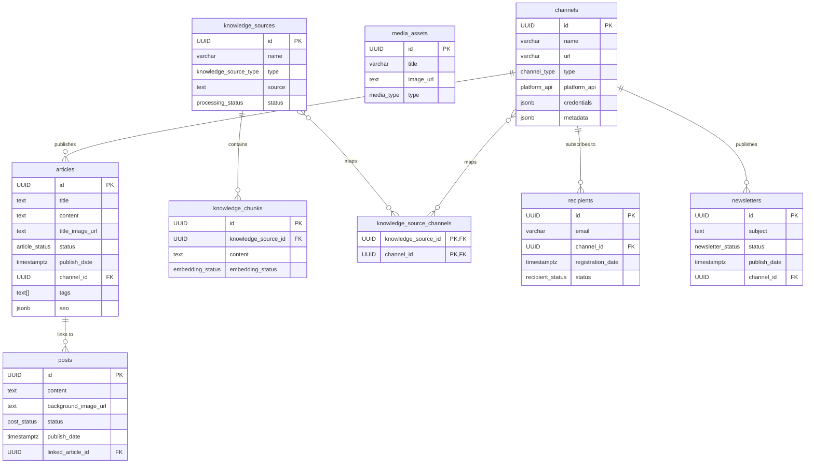

# Content AI Manager - Database Schema

This document outlines the database schema for the Content AI Manager application. The schema is designed to be relational and uses PostgreSQL-like syntax, leveraging features like `JSONB` for flexible data storage and `enums` for constrained value sets.

## Table of Contents
1.  [Enums](#enums)
2.  [Channels Table](#channels-table)
3.  [Media Assets Table](#media-assets-table)
4.  [Articles Table](#articles-table)
5.  [Posts Table](#posts-table)
6.  [Knowledge Sources Table](#knowledge-sources-table)
7.  [Knowledge Chunks Table](#knowledge-chunks-table)
8.  [Recipients Table](#recipients-table)
9.  [Newsletters Table](#newsletters-table)
10. [Knowledge Source Channels (Junction Table)](#knowledge-source-channels-junction-table)
11. [Relationships (ERD)](#relationships-erd)

---

## Enums

Defining custom types for statuses and categories helps maintain data integrity.

```sql
CREATE TYPE channel_type AS ENUM ('website', 'instagram', 'facebook', 'x', 'newsletter');
CREATE TYPE platform_api AS ENUM ('none', 'wordpress', 'instagram_graph', 'facebook_graph', 'x_api', 'email_api');
CREATE TYPE media_type AS ENUM ('instagram_post', 'article_feature', 'article_inline', 'icon');
CREATE TYPE article_status AS ENUM ('draft', 'approved', 'scheduled', 'published', 'archived');
CREATE TYPE post_status AS ENUM ('draft', 'approved', 'scheduled', 'published', 'deleted');
CREATE TYPE newsletter_status AS ENUM ('draft', 'scheduled', 'sent');
CREATE TYPE knowledge_source_type AS ENUM ('text', 'website', 'pdf', 'instagram', 'youtube', 'video_file', 'audio_file');
CREATE TYPE processing_status AS ENUM ('pending', 'processed', 'error');
CREATE TYPE embedding_status AS ENUM ('pending', 'complete', 'failed');
CREATE TYPE recipient_status AS ENUM ('subscribed', 'unsubscribed');
```

---

## `channels` Table

Stores information about the different platforms or websites where content will be published.

```sql
CREATE TABLE channels (
    id UUID PRIMARY KEY DEFAULT gen_random_uuid(),
    name VARCHAR(255) NOT NULL,
    url VARCHAR(2048) NOT NULL,
    type channel_type NOT NULL,
    platform_api platform_api NOT NULL,
    credentials JSONB, -- Encrypted in a real application
    metadata JSONB, -- { brandTone: string, targetAudience: string }
    created_at TIMESTAMPTZ NOT NULL DEFAULT now(),
    updated_at TIMESTAMPTZ NOT NULL DEFAULT now()
);

-- Indexes
CREATE INDEX idx_channels_type ON channels(type);
```

---

## `media_assets` Table

A library of all media (images, icons) used across the application.

```sql
CREATE TABLE media_assets (
    id UUID PRIMARY KEY DEFAULT gen_random_uuid(),
    title VARCHAR(255) NOT NULL,
    description TEXT,
    image_url TEXT NOT NULL, -- URL to image in cloud storage (e.g., S3)
    type media_type NOT NULL,
    created_at TIMESTAMPTZ NOT NULL DEFAULT now(),
    updated_at TIMESTAMPTZ NOT NULL DEFAULT now()
);

-- Indexes
CREATE INDEX idx_media_assets_type ON media_assets(type);
```

---

## `articles` Table

Stores long-form blog articles.

```sql
CREATE TABLE articles (
    id UUID PRIMARY KEY DEFAULT gen_random_uuid(),
    title TEXT NOT NULL,
    content TEXT NOT NULL, -- Stored as HTML
    title_image_url TEXT,
    title_image_alt TEXT,
    inline_images JSONB, -- [{ id: string, url: string, alt: string }]
    status article_status NOT NULL DEFAULT 'draft',
    publish_date TIMESTAMPTZ,
    author VARCHAR(255),
    excerpt TEXT,
    categories TEXT[],
    tags TEXT[],
    seo JSONB, -- { title: string, description: string, keywords: string, slug: string }
    channel_id UUID NOT NULL REFERENCES channels(id) ON DELETE CASCADE,
    created_at TIMESTAMPTZ NOT NULL DEFAULT now(),
    updated_at TIMESTAMPTZ NOT NULL DEFAULT now()
);

-- Indexes
CREATE INDEX idx_articles_status ON articles(status);
CREATE INDEX idx_articles_publish_date ON articles(publish_date);
CREATE INDEX idx_articles_channel_id ON articles(channel_id);
CREATE INDEX idx_articles_tags ON articles USING GIN(tags); -- For searching tags
CREATE INDEX idx_articles_categories ON articles USING GIN(categories);
```

---

## `posts` Table

Stores social media posts, primarily for Instagram.

```sql
CREATE TABLE posts (
    id UUID PRIMARY KEY DEFAULT gen_random_uuid(),
    content TEXT NOT NULL, -- The post caption
    background_image_url TEXT NOT NULL, -- Final composite image URL
    base_background_image_url TEXT, -- Original background image for re-editing
    overlays JSONB, -- [{ id, type, x, y, width, height, ... }]
    status post_status NOT NULL DEFAULT 'draft',
    publish_date TIMESTAMPTZ,
    platform VARCHAR(50) NOT NULL, -- 'instagram', 'facebook', 'x'
    tags TEXT[],
    location VARCHAR(255),
    tagged_users TEXT[],
    alt_text TEXT,
    disable_comments BOOLEAN DEFAULT FALSE,
    hide_likes BOOLEAN DEFAULT FALSE,
    linked_article_id UUID REFERENCES articles(id) ON DELETE SET NULL, -- Optional link
    created_at TIMESTAMPTZ NOT NULL DEFAULT now(),
    updated_at TIMESTAMPTZ NOT NULL DEFAULT now()
);

-- Indexes
CREATE INDEX idx_posts_status ON posts(status);
CREATE INDEX idx_posts_publish_date ON posts(publish_date);
CREATE INDEX idx_posts_linked_article_id ON posts(linked_article_id);
```

---

## `knowledge_sources` Table

Stores references to external or internal information that the AI can use as a knowledge base.

```sql
CREATE TABLE knowledge_sources (
    id UUID PRIMARY KEY DEFAULT gen_random_uuid(),
    name VARCHAR(255) NOT NULL,
    type knowledge_source_type NOT NULL,
    source TEXT NOT NULL, -- URL, text content, etc.
    status processing_status NOT NULL DEFAULT 'pending',
    ingested_content TEXT, -- AI-generated summary
    ingestion_log JSONB, -- [{ timestamp, message, level }]
    created_at TIMESTAMPTZ NOT NULL DEFAULT now(),
    updated_at TIMESTAMPTZ NOT NULL DEFAULT now()
);
```

---

## `knowledge_chunks` Table

Stores processed and chunked content from `knowledge_sources`, ready for embedding.

```sql
CREATE TABLE knowledge_chunks (
    id UUID PRIMARY KEY DEFAULT gen_random_uuid(),
    knowledge_source_id UUID NOT NULL REFERENCES knowledge_sources(id) ON DELETE CASCADE,
    content TEXT NOT NULL,
    embedding_status embedding_status NOT NULL DEFAULT 'pending',
    -- The 'embedding' column would use a vector extension like pgvector
    -- embedding VECTOR(1536), -- Example dimension for a specific model
    created_at TIMESTAMPTZ NOT NULL DEFAULT now(),
    updated_at TIMESTAMPTZ NOT NULL DEFAULT now()
);

-- Indexes
CREATE INDEX idx_knowledge_chunks_source_id ON knowledge_chunks(knowledge_source_id);
-- A vector index for fast similarity searches
-- CREATE INDEX idx_knowledge_chunks_embedding ON knowledge_chunks USING HNSW(embedding vector_cosine_ops);
```
---

## `recipients` Table

Stores information about newsletter subscribers.

```sql
CREATE TABLE recipients (
    id UUID PRIMARY KEY DEFAULT gen_random_uuid(),
    email VARCHAR(255) NOT NULL UNIQUE,
    channel_id UUID NOT NULL REFERENCES channels(id) ON DELETE CASCADE,
    registration_date TIMESTAMPTZ NOT NULL DEFAULT now(),
    last_notification_date TIMESTAMPTZ,
    status recipient_status NOT NULL DEFAULT 'subscribed',
    created_at TIMESTAMPTZ NOT NULL DEFAULT now(),
    updated_at TIMESTAMPTZ NOT NULL DEFAULT now()
);

-- Indexes
CREATE INDEX idx_recipients_channel_id ON recipients(channel_id);
CREATE INDEX idx_recipients_status ON recipients(status);
```

---

## `newsletters` Table

Stores email newsletters.

```sql
CREATE TABLE newsletters (
    id UUID PRIMARY KEY DEFAULT gen_random_uuid(),
    subject TEXT NOT NULL,
    content TEXT NOT NULL, -- Stored as HTML
    status newsletter_status NOT NULL DEFAULT 'draft',
    publish_date TIMESTAMPTZ,
    channel_id UUID NOT NULL REFERENCES channels(id) ON DELETE CASCADE,
    header_image_url TEXT,
    preview_text TEXT,
    sent_date TIMESTAMPTZ,
    recipient_count INTEGER,
    created_at TIMESTAMPTZ NOT NULL DEFAULT now(),
    updated_at TIMESTAMPTZ NOT NULL DEFAULT now()
);

-- Indexes
CREATE INDEX idx_newsletters_status ON newsletters(status);
CREATE INDEX idx_newsletters_publish_date ON newsletters(publish_date);
CREATE INDEX idx_newsletters_channel_id ON newsletters(channel_id);
```

---

## `knowledge_source_channels` (Junction Table)

This table creates a many-to-many relationship between knowledge sources and channels, allowing a single source to be associated with multiple channels.

```sql
CREATE TABLE knowledge_source_channels (
    knowledge_source_id UUID NOT NULL REFERENCES knowledge_sources(id) ON DELETE CASCADE,
    channel_id UUID NOT NULL REFERENCES channels(id) ON DELETE CASCADE,
    PRIMARY KEY (knowledge_source_id, channel_id)
);
```

---

## Relationships (ERD)


